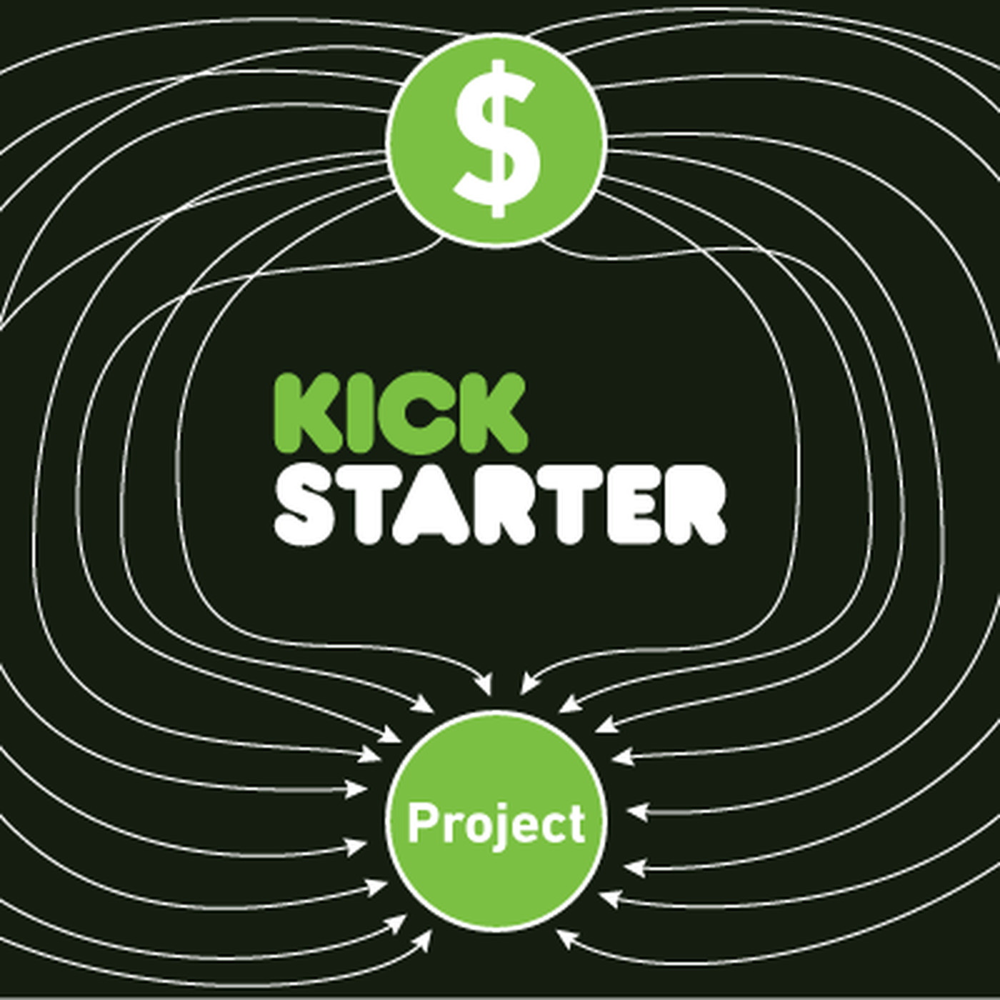

# Projects
---
# Predictive Modeling and Clustering Insights for Success on Shark Tank
Navigating the realm of innovative business ideas is a daunting task, with the elusive nature of groundbreaking
concepts. This challenge is vividly illustrated on the popular platform, Shark Tank, where
aspiring entrepreneurs present their ventures to a panel of investors, known as Sharks. The dynamic
involves negotiating a deal, often involving relinquishing a percentage of their business in exchange for
financial backing and the invaluable mentorship, connections, and expertise of the Sharks. The highstakes
nature of these negotiations compels the Sharks to meticulously scrutinize business profits, records,
and performance, aiming to validate the purported valuation of the business. Recognizing the intricacies
involved in this venture underscores the potential value of a predictive model capable of accurately
forecasting whether a business can secure a deal. Moreover, the insights gleaned from previous pitches
can empower entrepreneurs, offering them a strategic advantage in positioning themselves for success
while optimizing their use of time and resources.This project aims to develop a classification model to
predict business success on the platform, while also conducting exploratory data analysis and clustering
to extract actionable insights from past pitches, thereby providing a valuable resource for aspiring
entrepreneurs.
### Skills and Tools Used
- R
- Data wrangling
- Exploratory data analysis
- Boosting and Bagging
- Kmeans Clustering
- ggplot
- Data Visualization

[View Full Project on GitHub](https://github.com/Abdul-AA/Shark-Tank-Pitches/tree/610d9f5294d05c0468e4f81b3a20ce12bffd3f6d)

---
# Predictive Modeling and Clustering Insights for Kickstarter Success

Kickstarter, a renowned crowdfunding platform, operates on a unique premise where backers support
projects of interest through financial pledges. The platform employs an ”all or nothing” model, where
each project sets a financial goal, and its outcome is categorized as either failed or successful based on
whether the goal is achieved. The high stakes associated with this model underpin the importance of a
predictive model that can accurately forecast a project’s fate. Such a tool would be invaluable for project
creators, allowing them to assess the suitability of Kickstarter for their endeavor before committing,
ultimately saving time and resources. Moreover, delving into the diverse attributes of past projects
can provide creators with insights to strategically position their initiatives for success. Recognizing this
potential, this project aims to develop a classification model capable of predicting a project’s success
or failure. Additionally, the project seeks to employ clustering techniques on historical data to uncover
inherent patterns and trends among past Kickstarter projects, offering creators a deeper understanding
to enhance their project planning and execution strategies.
### Skills and Tools Used
- Python
- Pandas
- Matplotlib
- Seaborn
- Boosting and Bagging
- K-Prototypes clustering
- SHAP

[View Full Project on GitHub](https://github.com/Abdul-AA/Kickstarters/tree/main)

---
# Optimizing the Grid

Collaborated with a team of five on an optimization project utilizing mixed-integer programming to determine the optimal path to achieve Canada's net-zero emissions in the electricity sector by 2035. Aligned with Canada's commitments to the Paris Agreement, the project addressed the complexity of balancing environmental, economic, and social factors. Utilized a multi-objective mixed-integer programming (MIP) approach and goal programming (GP) approach to explore trade-offs and compromises. The MIP model outlined a roadmap for electricity generation and technology investment, considering cost minimization and reliable energy supply. The GP model assessed the broader feasibility of emissions, energy generation, capacity goals, and capital costs. The project contributes to environmental and energy debates, emphasizing the potential of data modeling for conceptualization in complex problem-solving. The report provides insights into model formulation, implementation, results, implications, potential extensions, and lessons learned in the application of linear optimization in complex and uncertain environments.

### Skills and Tools Used
- Mixed integer programming
- Goal programming
- Python (Gurobi, Pandas, NumPy, Plotly, seaborn, and Matplotlib)

[View Full Project on GitHub](https://github.com/Abdul-AA/Canada-Net-Zero-Optimization.git)

---

# Diabetes Classifier

Diabetes mellitus is a group of diseases that affects how the body regulates and uses glucose. It is characterized by abnormally high levels of glucose in the blood. A hormone known as insulin regulates glucose levels in the blood. It is produced by the islet cells in the pancreas—an impairment in the body's ability to make or respond to insulin results in diabetes. Diabetes is commonly classified into type 1 diabetes and type 2 diabetes. The former, also known as insulin-dependent diabetes, is an autoimmune disease whereby the islet cells are destroyed and unable to produce insulin, while the latter occurs when cells do not produce enough insulin and the body does not respond normally to insulin. Type 2 diabetes, also known as insulin-resistant diabetes, is the commonest type of diabetes. Other types include prediabetes and gestational diabetes. Using machine learning to diagnose diabetes will make the diagnostic process more efficient, which will, in turn, make treatment easier and perhaps more effective.

### Skills and Tools Used
- Exploratory data analysis
- Supervised learning
- Python (Pandas, NumPy, ScikitLearn, seaborn, and Matplotlib)

[View Full Project on GitHub](https://github.com/Abdul-AA/abdul-aa.github.io/blob/992975644d94be324350ec11930b6d4699214057/Notebooks/diabetes.ipynb)

---

# Data Analysis: Comcast Telecom Consumer Complaints

Comcast is the largest American global telecommunication conglomerate. In October 2016, they received a fine of $2.3 million from the Federal Communications Commissions (FCC) after customers filed more than 2000 complaints between April, 2016 and June, 2016. The fine was purportedly the largest civil penalty imposed on a cable operator. The FCC claimed they fined Comcast for wrongfully charging customers, but Comcast refuted this claim. The company's database serves as a repository of public customer complaints filed against Comcast. I will analyze the relevant data to pin down Comcast's customer service flaws, how the organization could improve, and if they received a significant number of billing- related complaints.

### Skills and Tools Used
- Exploratory data analysis
- Python (Pandas and Numpy)

[View Full Project on GitHub](https://github.com/Abdul-AA/abdul-aa.github.io/blob/e0a9468ab53445e5926012f76abcf79d2b03208c/Notebooks/Comcast%20Data%20Analysis.ipynb)

---

